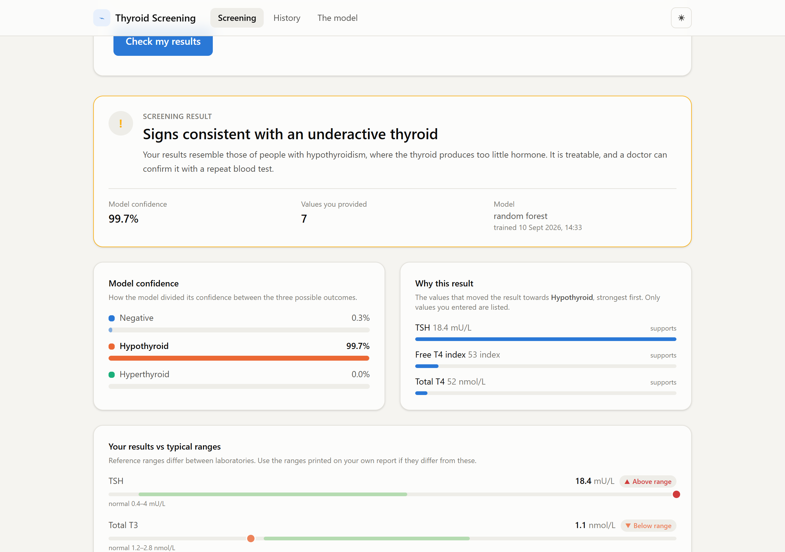
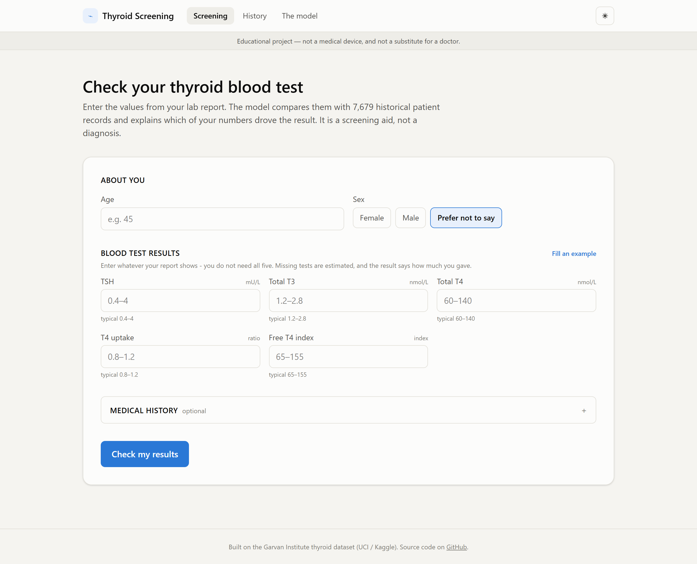
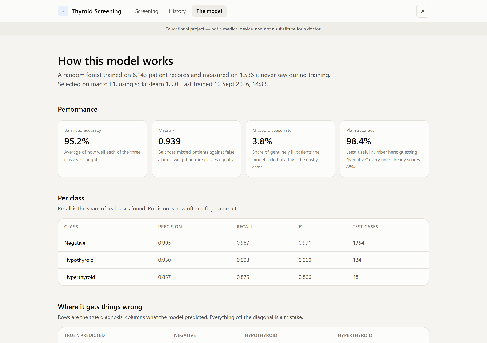
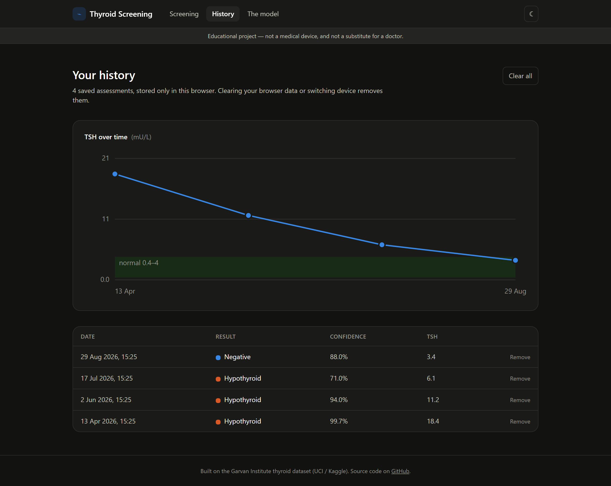

# Thyroid Disease Detection

A thyroid screening tool that turns a blood-test report into an explained result:
a machine-learning API, a patient-facing web app, and an honest account of how
well the model actually performs.

[](https://github.com/iamarslankhalid/Thyroid-Disease-Detection/actions/workflows/ci.yml)

> **Educational project — not a medical device.** It does not diagnose anything.
> Every result carries that warning, and so does this README.

---

## What it does

A patient enters whatever their lab report shows — even a single TSH value — and gets back:

- **A screening result** (Negative / Hypothyroid / Hyperthyroid) with the model's confidence
- **Why it said that**: the specific values that drove the result, measured per patient rather than pulled from a global feature-importance chart
- **Their numbers against reference ranges**, so nothing rests on the model's word alone
- **A printable report** and a **local history** with a TSH trend over time
- **A transparency page** showing the confusion matrix, per-class recall and known limits



| Screening form | Model transparency | History, in dark mode |
|---|---|---|
|  |  |  |

---

## Results

Random forest, selected on cross-validated macro F1, measured on 1,536 held-out patients:

| model | macro F1 | balanced acc. | accuracy | missed disease |
|---|---|---|---|---|
| **random forest** *(selected)* | **0.939** | 0.952 | 0.984 | 3.8% |
| hist gradient boosting | 0.924 | 0.954 | 0.980 | 3.8% |
| SVM (RBF) | 0.866 | 0.961 | 0.956 | 2.7% |
| logistic regression | 0.829 | 0.950 | 0.945 | 2.2% |
| KNN | 0.755 | 0.685 | 0.930 | 54.4% |
| *baseline: always "Negative"* | *0.312* | *0.333* | *0.882* | *100%* |

**Read the baseline row first.** A model that calls every patient healthy scores
88.2% accuracy on this dataset while missing every sick person. That is why
accuracy is the last column here and macro F1 is the first.

Per class, for the selected model:

| class | precision | recall | F1 | test cases |
|---|---|---|---|---|
| Negative | 0.995 | 0.987 | 0.991 | 1,354 |
| Hypothyroid | 0.930 | 0.993 | 0.960 | 134 |
| Hyperthyroid | 0.857 | 0.875 | 0.866 | 48 |

Full details, including the confusion matrix and the reasons specific columns
were excluded, are generated into [`models/MODEL_CARD.md`](models/MODEL_CARD.md)
by the training run itself.

---

## Quick start

```bash
git clone https://github.com/iamarslankhalid/Thyroid-Disease-Detection.git
cd Thyroid-Disease-Detection

python -m venv .venv && .venv/Scripts/activate   # Linux/macOS: source .venv/bin/activate
pip install -r requirements-dev.txt

python -m ml.train                # ~30s, writes models/thyroid_model.joblib
cd frontend && npm ci && npm run build && cd ..
uvicorn backend.app.main:app --reload
```

Open <http://127.0.0.1:8000>. The API documentation is at `/docs`.

With Docker, the whole thing is one image:

```bash
docker build -t thyroid-screening .
docker run -p 8000:8000 thyroid-screening
```

### Working on the frontend

Run the API and Vite side by side — Vite proxies `/api` to uvicorn and hot-reloads:

```bash
uvicorn backend.app.main:app --reload      # terminal 1
cd frontend && npm run dev                 # terminal 2, http://localhost:5173
```

---

## Architecture

```text
             ┌───────────────────────────┐
Lab report → │  React + TypeScript UI    │  form → result → explanation
             │  (Vite, Tailwind)         │  history in localStorage
             └─────────────┬─────────────┘
                           │  POST /api/predict
             ┌─────────────▼─────────────┐
             │  FastAPI                  │  Pydantic validates clinical ranges
             │  backend/app              │  and refuses impossible input
             └─────────────┬─────────────┘
             ┌─────────────▼─────────────┐
             │  scikit-learn Pipeline    │  impute → scale → random forest
             │  models/*.joblib          │  + per-patient explanation
             └───────────────────────────┘
```

The preprocessing lives *inside* the pickled pipeline, so serving cannot apply a
different transformation than training did. The artifact also carries its own
feature order, class names, metrics and scikit-learn version, and the API reads
units and reference ranges from the same `ml/config.py` the model was trained
from — the UI never hard-codes a clinical value.

```text
ml/            data cleaning, pipeline, training, evaluation, explanation
backend/app/   FastAPI: schemas, model service, routes; serves the built UI
frontend/src/  React app: pages, components, typed API client
tests/         53 tests over cleaning, imputation, validation and the API
models/        trained artifact + generated model card
reports/       metrics.json and the dataset report from the last run
notebooks/     the original exploratory notebook, kept as history
```

---

## What changed, and why

This started as a university notebook that reported 97.6% accuracy. The
rebuild reports 98.4% — and the interesting part is that the first number was
meaningless while the second one is defensible. The problems that were fixed:

**Missing lab values were filled with random numbers.** The notebook replaced
missing TSH, T3 and T4U with uniform random draws between mean ± standard
deviation. For TSH that range is roughly −19 to +29, so the training data ended
up containing *negative* TSH readings, which cannot exist. No seed was set, so
every run trained on different data — which is why the notebook's numbers never
matched its own README. Missing values now stay missing and are imputed inside
the pipeline, fitted on the training fold only.

**The outlier filter deleted the patients it most needed.** Rows more than three
standard deviations above the mean were dropped — that is, the highest TSH
readings, which are the clearest hypothyroid cases in the dataset. Extreme lab
values are now kept; only physically impossible ones (an age of 65,526) are
treated as missing.

**Accuracy was the only metric.** With 88% healthy patients, "always Negative"
already scores 0.88. Model selection now runs on cross-validated macro F1, and
every report shows per-class recall and the share of ill patients missed.

**Preprocessing leaked across the train/test split.** Imputation happened before
splitting, so test-set statistics reached the training data. Everything now
happens inside a `Pipeline` under a `StratifiedKFold`.

**Clinically important inputs were thrown away.** The notebook kept 8 of 30
columns, dropping whether the patient takes thyroxine or antithyroid
medication, has had thyroid surgery, or has a goitre. All 20 usable features are
back. `referral_source` stays out on purpose: it encodes which clinic sent the
sample, which correlates with the diagnosis in this dataset but is unknown for a
new patient — using it would inflate the scores and fail in the real world.

**The prediction helper was broken.** It passed 7 features in a different order
to a model expecting 8, and its own test case described a pregnant male patient.
The feature order now lives in the artifact, and tests cover the contract.

**KNN and SVM were trained on unscaled features**, so distance was dominated by
whichever measurement happened to have the largest units. Both are still
compared, now on scaled inputs — KNN's honest macro F1 is 0.755.

---

## Responsible use

- **Not a diagnosis.** The output says a set of numbers *resembles* a group in a historical dataset. Only a doctor can diagnose a thyroid disorder.
- **The data is from the 1980s**, collected at one Australian clinic. Assay methods and reference ranges have changed; real-world accuracy today would be lower.
- **Hyperthyroidism is rare here** — 241 cases in the whole dataset — so that class is the least reliable.
- **Never externally validated** on patients from another hospital, country or era.
- **No health data leaves the browser.** Assessment history is stored in `localStorage`; there is no account, no database and nothing to leak. The trade-off is that history does not follow you to another device.
- Modern lab reports usually give free T4 and free T3, while this dataset uses the older T4-uptake and free-T4-index measures. Missing inputs are imputed, and a result from fewer values deserves less weight.

---

## Dataset

Garvan Institute thyroid disease data, via the
[UCI Machine Learning Repository](https://archive.ics.uci.edu/dataset/102/thyroid+disease)
and [Kaggle](https://www.kaggle.com/datasets/emmanuelfwerr/thyroid-disease-data).
9,172 records, of which 7,679 carry one of the three diagnoses this project
classifies; the rest (binding-protein anomalies, replacement therapy, discordant
assays) are dropped rather than relabelled.

## Contributors

- [Muhammad Arslan Khalid](https://github.com/iamarslankhalid)
- [Zainab Nadeem](https://github.com/imzainabnadeem)
